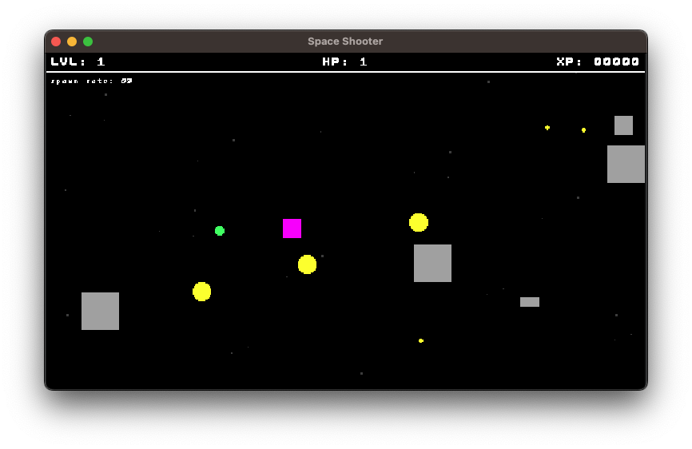

# 🎮 Turbo Demo Games


Welcome to the official repository of Turbo Demo Games - a collection of sample games created using the Turbo game engine. These demos are designed to showcase the capabilities of Turbo and provide inspiration for your game development projects.

## Getting Started

First, [install Turbo](https://docs.turbo.computer/#/quick-start?id=installation)

Next, clone this repository to explore the demo games:

```bash
git clone https://github.com/jozanza/turbo-demos.git
```

Each demo game is contained in its own directory and includes source code and assets.

## Running the Demos

From the root of the project, you can run the following command:

```bash
turbo run -w <demo-name>
```

For example, to run the Bork Runner game demo:

```bash
turbo run -w bork-runner
```

Feel free to run, modify, and use these demos as a starting point for your projects. For more information on how to use Turbo and work with these demos, check out [Turbo's Documentation](https://docs.turbo.computer).

## Demos

|                       [Game of Life](./game-of-life)                       |                      [Pong](./pong)                       |                      [Tanks](./tanks)                       |
| :------------------------------------------------------------------------: | :-------------------------------------------------------: | :---------------------------------------------------------: |
| []("./game-of-life) | [](./pong) | [](./tanks) |

|                      [Space Shooter](./space-shooter)                       |                       [Pancake Cat](./pancake-cat)                       |                      [Bork Runner](./bork-runner)                       |
| :-------------------------------------------------------------------------: | :----------------------------------------------------------------------: | :---------------------------------------------------------------------: |
| [](./space-shooter) | [](./pancake-cat/) | [](./bork-runner) |

|                      [Solana Lumberjack](./solana-lumberjack)               |     |     |
| :-------------------------------------------------------------------------: | :-: | :-: |
| [](./solana-lumberjack) |  [](./solana-lumberjack)   |  [](./solana-lumberjack)   |

## Contributing

We welcome contributions to our demo collection! Please read our [Contributing Guidelines](./CONTRIBUTING.md) for more information on how you can contribute.

## Support

If you encounter any issues or have questions, please [open an issue](https://github.com/super-turbo-society/turbo-demos/issues) in this repository.
