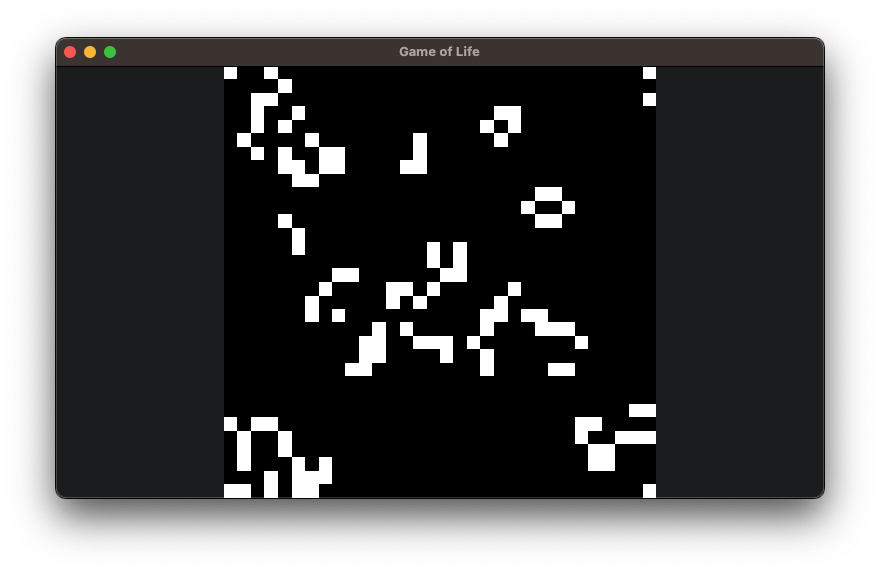

# 🎮 Turbo Demo Games


Welcome to the official repository of Turbo Demo Games - a collection of sample games created using the Turbo game engine. These demos are designed to showcase the capabilities of Turbo and provide inspiration for your game development projects.

## Getting Started

First, [install Turbo](https://docs.turbo.computer/#/quick-start?id=installation)

Next, clone this repository to explore the demo games:

```bash
git clone https://github.com/super-turbo-society/turbo-demos.git
```

Each demo game is contained in its own directory and includes source code and assets.

## Running the Demos

From the root of the project, you can run the following command:

```bash
turbo run -w <demo-name>
```

For example, to run the Bork Runner game demo:

```bash
turbo run -w bork-runner
```

Feel free to run, modify, and use these demos as a starting point for your projects. For more information on how to use Turbo and work with these demos, check out [Turbo's Documentation](https://docs.turbo.computer).

## Demos

[](./hello-world/)
[](./pong/)
[](./tanks/)
[](./pancake-cat/)
[](./bork-runner/)
[](./space-shooter/)
[](./game-of-life/)

## Contributing

We welcome contributions to our demo collection! Please read our [Contributing Guidelines](./CONTRIBUTING.md) for more information on how you can contribute.

## Support

If you encounter any issues or have questions, please [open an issue](https://github.com/super-turbo-society/turbo-demos/issues) in this repository.
