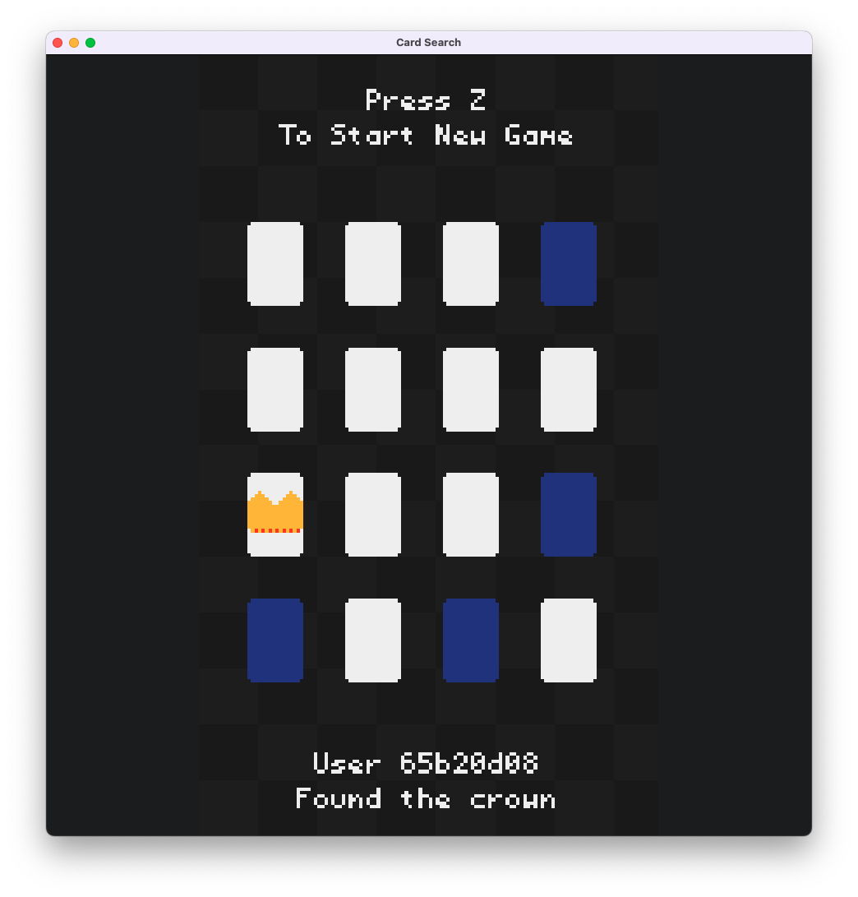

# Card Search



## Description

Flip cards until you find the Crown! This game uses Turbo OS to support networked multiplayer.

The board is generated into a file named "board", and all players watch that file to see the same board. Whenever a player clicks on a card, the board file is updated.
## Key Code Snippets

### Generate the Board on Turbo OS

This function creates a board, gets a random number from the server, and sets one card to be the crown based on the random number. Then it writes the new board to a file at the filepath "board".

Lastly it logs the card number of the crown, and then commits the changes.

```rust
#[export_name = "turbo/generate_board"]
unsafe extern "C" fn on_generate_board() -> usize {
    let file_path = format!("board");
    let mut board = generate_board();
    //get a random number from the server
    let mut num: u32 = os::server::random_number();
    //set the random to a number between 0 and 15
    num = num % BOARD_SIZE as u32;
    for c in &mut board.cards {
        if c.id as u32 == num {
            c.is_crown = true;
        }
    }
    //write the new board to the server
    let Ok(_) = os::server::write!(&file_path, board) else {
        return os::server::CANCEL;
    };

    os::server::log!("Crown: {}", num);
    return os::server::COMMIT;
}
```
### Update the board when a card is clicked

Everytime any player clicks a card, they send the card number to the server to update the board file.

This function reads the current state of the board, then sets is_flipped to true on the card that was clicked.

To call the function, we serialize the card id, then send it as command data. Command data always has to be serialized before it is sent.

```rust
let bytes = self.id.to_le_bytes();

os::client::exec("card_search", "card_click", &bytes);  
```

Then we read the command data in our function, providing the data type that we want to deserialize it as. In this case it is a u8.

After we've updated the board, we check if the user found the crown. If they did, we send an alert to all players to let them know who found it.

Lastly, we write to the master file again to update the board and then commit the function.

```rust
#[export_name = "turbo/card_click"]
unsafe extern "C" fn on_card_click() -> usize {
    //read the current board from the server
    //or if there is no board, then make a blank board
    let mut board = os::server::read_or!(Board, "board", Board { cards: Vec::new() });
    //if there is no board, cancel the function
    if board.cards.len() == 0 {
        return os::server::CANCEL;
    } else {
        //num is the command data, which is the card id
        let num = os::server::command!(u8);
        for c in &mut board.cards {
            if c.id == num && c.is_flipped == false {
                c.is_flipped = true;
                if c.is_crown {
                    let userid = os::server::get_user_id();
                    let userid = truncate_string(&userid, 8);
                    //send alert of the user id that found the crown card
                    os::server::alert!("{}", userid);
                }
            }
        }
        //write the file
        let Ok(_) = os::server::write!("board", board) else {
            return os::server::CANCEL;
        };
    }

    return os::server::COMMIT;
}
```

### Reading files on the front end

On the front end, we use the watch_file function to track files and read data. Generally we want to watch files in the go loop so they stay constantly updated.

```rust
state.board = watch_file("card_search", "board", &[("stream", "true")])
        .data
        .and_then(|file| Board::try_from_slice(&file.contents).ok()); //deserialize the board
```

watch_file returns a QueryResult, so we have to take the data, and then deserialize it. If the data isn't found (e.g. the filepath is wrong), this will return None.

We also watch for alerts, in a very similar way.

```rust
if let Some(event) = os::client::watch_events("card_search", Some("alert")).data {
        //Display an alert banner for notifications that are < 10s old
        let duration = 10_000;
        let millis_since_event = time::now() - event.created_at as u64 * 1000;
        if millis_since_event < duration {
            if let Ok(msg) = std::str::from_utf8(&event.data) {
                let txt = format!("User {}", msg);
                centered_text(&txt, 200, CARD_FLIPPED_COLOR);
                centered_text("Found the crown", 210, CARD_FLIPPED_COLOR);
            }
        }
    }
```

This always returns the most recent alert if there is one. We can pull the data we need, in this case .create_at (what time the alert originated) and .data (the data from the alert).