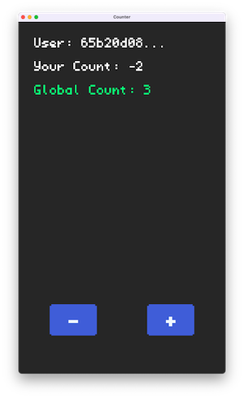

# Counter



## Description

Add to a global counter, shared by everyone who plays the game. This demo is an intro to working with the Turbo OS file system and shows how to get the user ID, write data to files, and read from files.

## Working with Turbo OS

We can use one function to update both the global counter and your user count. When we call this function we tell it how much to change the counter by, depending on if you clicked + or -

```rust
//subtract 1 if minus button is clicked
    if m.left.just_pressed() && button_contains_pos(m.position[0], m.position[1], w, h, x, y) {
        let delta: i32 = -1;
        let bytes = delta.to_le_bytes();
        os::client::exec("counter", "increment_counter", &bytes);
    }
```

When we send data into a turbo OS function, we need to serialize it first. We use ```.to_le_bytes()``` to serialize numbers, but we can also serialize structs by using ```.try_to_vec()```.

Looking at the on_increment_counter function, you can see how to read and write to Turbo OS files.

```rust
#[export_name = "turbo/increment_counter"]
unsafe extern "C" fn on_increment_counter() -> usize {
    let userid = os::server::get_user_id();
    let file_path = format!("users/{}", userid);
    //read the current number from the users file, or set it to 0 if it doesn't exist
    let mut counter = os::server::read_or!(i32, &file_path, 0);
    //get command data from the function call
    let increment_amt = os::server::command!(i32);

    counter += increment_amt;

    let Ok(_) = os::server::write!(&file_path, counter) else {
        return os::server::CANCEL;
    };

    let file_path = "global_count";
    let mut counter = os::server::read_or!(i32, &file_path, 0);
    counter += increment_amt;
    let Ok(_) = os::server::write!(&file_path, counter) else {
        return os::server::CANCEL;
    };
    os::server::log!("Counter: {}", counter);
    return os::server::COMMIT;
}

```
First, this function reads the counter value from the existing user file. Using the ```read_or!``` macro lets us either pull the value from the existing file, or write the value if that file doesn't exist yet.

Next, we get the increment_amt by reading the command data. The ```command!``` macro will automatically deserialize the data to the provided type.

We add the incremenet_amt to the counter, then write it back into the filepath that we got it from. This updates the user count.

Next we want to do the same thing for the global count. Read the file using the ```read_or!``` macro, add the increment_amt, and then write back to the same filepath

The last thing we do is log the counter on the server.

### Watching files on the client side

On the front end, we use the ```watch_file``` function to track files and read data. Generally we want to watch files in the go loop so they stay constantly updated. 

Notice that when we are working locally we use ```os::client```, but when we are working inside a turbo os function we use ```os::server```.

```rust
//draw the user's saved counter
        let filepath = format!("users/{}", id);
        //read the number from the server using watch_file
        let num = os::client::watch_file("counter", &filepath, &[("stream", "true")])
            .data
            .and_then(|file| i32::try_from_slice(&file.contents).ok())
            .unwrap_or(0); //set to 0 if the file doesn't exist
        let txt = format!("Your Count: {}", num);
        text!(&txt, x = 10, y = 25, font = Font::M, color = WHITE_COLOR);
```

```watch_file``` returns a QueryResult, and ```.data``` contains the contents of that file. This data is still serialized, so we have to deserialize it ourselves using ```try_from_slice(&file.contents)```. 

Then we use ```.unwrap_or(0)``` to set the value to 0 in the event that we can't find the filepath for some reason.

