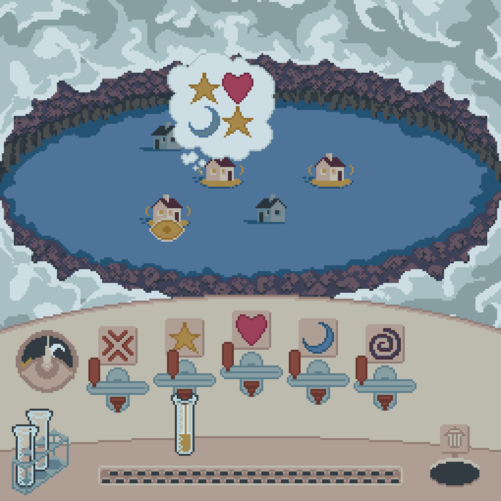
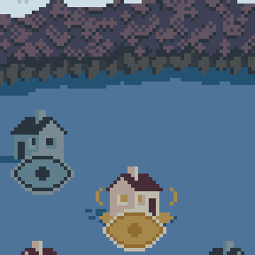

<p align="center"></p>

# Description
Lull a sleepy town to dreamland. Using the mouse, hover over awake dreamers to see their feelings, fill vials of sand with matching feelings and give them to dreamers to put them to bed before daybreak. 7 consecutive rounds of increasing difficulty.

<p align="center"> </p>

# Overview
Dreamland is state-driven, using the enum ``PlayState``. Most states are static menus; ``MainMenu``, ``Prelude``, ``GameMenu``, ``Scoring`` and `Paused`. `PlayState::Game` runs the core game loop of dreamland. This loop persists until either the night timer has elapsed or all ``Dreamers`` are asleep.
## Definitions
### ``Dreamer``: struct
Assigned a random selection of Feelings to be satisfied when they are created. ``Dreamer::spawn()`` constructs a ``Vec<Dreamer>`` with random spawn positions in a grid. When a ``Vial`` is given to a dreamer, they are put to ``sleep()`` and a satisifaction score is calculated by comparing their desired ``Feelings`` with the ``Vial's`` contents. ``Dreamers`` have an ``awake_timer`` which is a multiplier to their satisfaction, and are automatically put to ``sleep()`` when it has elapsed.
### ``Feeling``: enum
Used by ``SandTaps``, ``Vials`` and ``Dreamers``. Represented in game by colored icons and sand in ``Vials``. Has functions for referencing corresponding color ``u32s`` and sprite strings.
### ``SandTap``: struct
Connects with and takes ownership of ``Vials`` from the ``GameState``. Pours sand at a rate determined by its ``flow`` value. ``flow`` is determined by its handle position, which can be clicked and dragged.
### ``Vial``: struct
Created by ``VialSource``, can be clicked and dragged. Attached to ``SandTaps`` to be filled with ``Feeling`` contents. Destroyed when dragged onto a ``Dreamer`` or ``Trash``.

# Project Structure

### ``lib.rs``
Contains core Turbo functions and manages ``GameState``. ``GameState`` runs state machine of enum ``PlayState``. ``GameState`` owns all instantiated structs and accesses their functionality contextually. ``Turbo::go!`` is broken into sub-functions ``player_input()``, ``game()`` and ``draw()``.
### ``game_structs.rs``
Contains game structs that are instantiated and owned by the ``GameState``. This includes all structs detailed in the Overview section.
### ``util.rs`` and ``mouse_fn.rs``
Contains structs and enums with abstract functionality referenced globablly. ``mouse_fn.rs`` contains the ``Hover`` trait.
### ``/aseprite``
If you own aseprite, you can view my working files for pixel art. Turbo's global canvas is 2048x2048px, so sprite dimensions/packing are important to consider. I don't recommend using tutorial gifs like I have, they take up a lot of global canvas space.

# Key Code Snippets
## Implementing GameState
``GameState`` is implemented outside of the ``turbo::init!`` function so that it can be rebuilt and reconfigured for each round of the game using ``GameState::new()``, and so that it contains state machine behavior that can alter the current ``GameState``.
```rust
turbo::init! {
    struct GameState {
        // tracked game variables
    } = {
        Self::new(PlayState::MainMenu, 0, 0)
    }
}

impl GameState {
    pub fn new(state: PlayState, round: u32, score: i32) -> Self {
        // ...
        Self {
            // construct GameState from determined variables
        }
    }

    // Switches state machine and transitions the game scene
    pub fn switch_play_states(&mut self, play_state: PlayState) {
        match play_state {
            PlayState::MainMenu => {}, // Reload GameState to 0
            PlayState::Prelude => {}, // Move continue button
            PlayState::GameMenu => { // Rebuild GameState to next round, tween PlayerArea in
                *self = GameState::new(PlayState::MainMenu, self.round + 1, self.game_score); // Rebuild GameState
            },
            PlayState::Game => {}, // Tween clouds out, update night counter, reset wake timer
            PlayState::Scoring => {}, // Move continue button, tween clouds in and PlayerArea out, reset some of GameState, calculate score
            PlayState::Paused => {} // Tween clouds in
        }
        self.play_state = play_state; // Set new PlayState
    }
}
```

## Hover Trait
The ``Hover`` trait is implemented by any game structs that are moused over. Compares mouse position and provided hitbox. Returns ``Option<&mut self>``, which 1) is type agnostic so that any struct that implements this trait can return a mutable reference to itself without having to return a more specific type and 2) can return ``None`` as null value if the mouse is not hovering over it.
```rust
pub trait Hover {
    // Function to return reference to Self if mouse is hovering over
    fn hover(&mut self, hitbox: (i32, i32, i32, i32), mx: i32, my: i32) -> Option<&mut Self> {
        if mx >= hitbox.0 && mx <= hitbox.0 + hitbox.2 
        && my >= hitbox.1 && my <= hitbox.1 + hitbox.3 {
            Hover::hover_state(self, true);
            return Some(self)
        } else {
            Hover::hover_state(self, false);
            return None
        }
    }

    fn hover_state(&mut self, _hover: bool) {}
}
// ...
impl Hover for UIButton{
    fn hover_state(&mut self, hover: bool) {
        if hover {
            self.hovered = true;
        } else {
            self.hovered = false;
        }
    }
}
```
