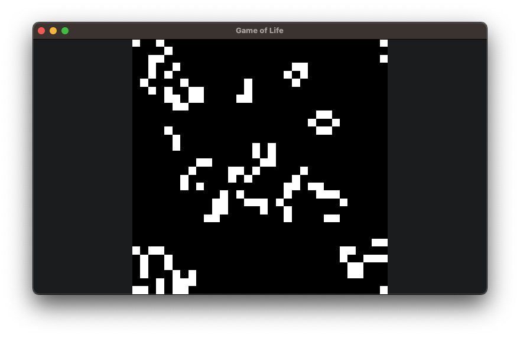

# Game of Life



## Description

"Game of Life" is a digital simulation of Conway's Game of Life, a cellular automaton devised by the British mathematician John Horton Conway in 1970. This game simulates the birth, survival, and death of cells on a square lattice based on a set of rules. It's a zero-player game, meaning that its evolution is determined by its initial state, requiring no further input from players.

## Getting Started

To run this game, clone the repository and navigate to the project directory.

Run the following command:

```sh
turbo-cli run -w .
```

The screen starts blank. Use `spacebar` or touch anywhere on mobile to reset the game.

## Walkthrough

**Configuration**

```rust
turbo::cfg! {r#"
    name = "Game of Life"
    version = "1.0.0"
    author = "Turbo"
    description = "Conway's Game of Life Simulation"
    [settings]
    resolution = [256, 256]
"#}
```

The game configuration sets up basic information about the game, such as its name, version, and author.

**Initialization**

```rs
turbo::init! {
    struct GameState {
        grid: Vec<Vec<bool>>,
        next_grid: Vec<Vec<bool>>,
        cell_size: u32,
    } = {
        let cell_size = 8; // Size of each cell in pixels
        let grid_size = 256 / cell_size; // Number of cells in each dimension
        Self {
            grid: vec![vec![false; grid_size as usize]; grid_size as usize],
            next_grid: vec![vec![false; grid_size as usize]; grid_size as usize],
            cell_size,
        }
    }
}
```

## Game Loop

The game loop is the core of your game, handling user input, updating the game state, and rendering. A typical Turbo game loop follows the following pattern:

```rust
turbo::go! {
    let mut state = GameState::load();

    if gamepad(0).start.just_pressed() || gamepad(0).select.just_pressed() || mouse(0).left.just_pressed() {
        // Randomize grid on A button press
        for row in 0..state.grid.len() {
            for col in 0..state.grid[row].len() {
                state.grid[row][col] = rand() % 2 == 0;
            }
        }
    }

    // Game logic
    for y in 0..state.grid.len() {
        for x in 0..state.grid[y].len() {
            let alive_neighbours = count_alive_neighbours(&state.grid, x, y);
            // Alive cell logic
            if state.grid[y][x] {
                // An alive cell survives if it has exactly 2 or 3 alive neighbours, otherwise it dies
                state.next_grid[y][x] = alive_neighbours == 2 || alive_neighbours == 3;
            } else {
                // A dead cell becomes alive if it has exactly 3 alive neighbours
                state.next_grid[y][x] = alive_neighbours == 3;
            }
        }
    }

    // Swap grids
    let temp = state.grid;
    state.grid = state.next_grid;
    state.next_grid = temp;

    // Drawing
    clear(0x000000ff); // Clear screen with black


    for y in 0..state.grid.len() {
        for x in 0..state.grid[y].len() {
            if state.grid[y][x] {
                let x_pos = x as i32 * state.cell_size as i32;
                let y_pos = y as i32 * state.cell_size as i32;
                rect!(x = x_pos, y = y_pos, w = state.cell_size, h = state.cell_size, color = 0xffffffff); // Draw living cell
            }
        }
    }

    state.save();
}
```

There's also a helper function to count "alive" neighbors:

```rust
// Helper function to count alive neighbours
fn count_alive_neighbours(grid: &Vec<Vec<bool>>, x: usize, y: usize) -> i32 {
    let mut count = 0;
    for i in -1..=1 {
        for j in -1..=1 {
            if i == 0 && j == 0 {
                continue;
            }
            let new_x = (x as i32 + i).rem_euclid(grid.len() as i32) as usize;
            let new_y = (y as i32 + j).rem_euclid(grid.len() as i32) as usize;
            if grid[new_y][new_x] {
                count += 1;
            }
        }
    }
    count
}
```