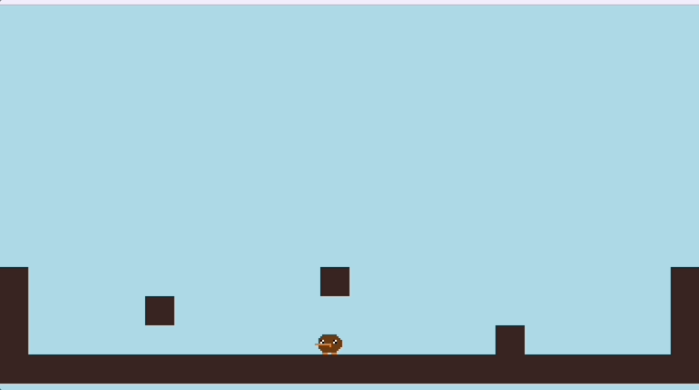
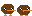
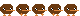
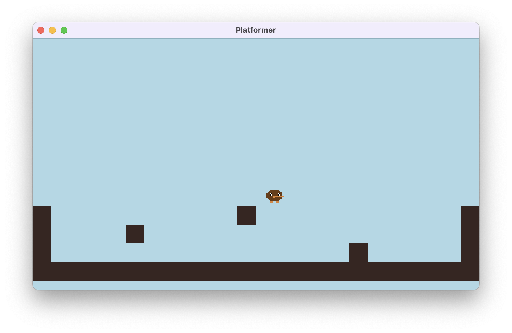

# Turbo Platformer Tutorial



## Description

A basic platformer template made in Turbo! This tutorial will show you the key building blocks you need to make a 2D platformer style game.

## Getting Started

If you want to follow along with the tutorial and write the code on your own, start by running the turbo init command

```sh
turbo init platformer
```

And then run the game
```sh
turbo run -w
```

**Development Tips:**
- If you update sprites while your game is running, Turbo will immediately show the changes. Just be sure to restart Turbo when adding new sprites.
- Using the keyboard shortcut `cmd+r / ctrl+r` will reset your game to its initial state

## Walkthrough

### Game Configuration  

The `turbo::cfg!` macro is used to define metadata and settings for your game.

- `name, version, author`: Basic information about your game.
- `description`: A short description of your game.
- `resolution`: The resolution of the game window.

```rs
turbo::cfg! {r#"
    name = "Platformer"
    version = "1.0.0"
    author = "Turbo"
    description = "A turbo platformer template"
    [settings]
    resolution = [384, 216]
"#} 
```

### Part One: Render the tiles and player

We're going to use these sprites for the player and tiles:

IDLE:


WALKING:


TILE:


To start, we're going to render our player and tiles on screen. We can make a custom struct and impl for each. A struct holds data related to a specific object type, and an impl holds functions.

```rs
#[derive(BorshDeserialize, BorshSerialize, Debug, Clone, PartialEq)]
struct Player {
    x: f32,
    y: f32,
    speed_x: f32,
    speed_y: f32,
    max_gravity: f32,
    is_falling: bool,
    is_facing_left: bool,
    is_landed: bool,
}

impl Player {
    fn new(x: f32, y: f32) -> Self {
        Self {
            x,
            y,
            speed_x: 0.0,
            speed_y: 0.0,
            max_gravity: 15.0,
            is_falling: false,
            is_facing_left: false,
            is_landed: false,
        }
    }

    fn draw(&self) {
            sprite!(
                "kiwi_idle",
                x = self.x as i32,
                y = self.y as i32,
                flip_x = self.is_facing_left,
                fps = fps::FAST
            );
        }
    }

#[derive(BorshSerialize, BorshDeserialize, PartialEq, Debug, Clone)]
struct Tile {
    grid_x: usize,
    grid_y: usize,
}

impl Tile {
    fn new(grid_x: usize, grid_y: usize,) -> Self {
        Self {
            grid_x,
            grid_y,
        }
    }

    fn draw(&self) {
        let x = self.grid_x as i32 * TILE_SIZE;
        let y = self.grid_y as i32 * TILE_SIZE;

        sprite!("tile", x = x, y = y);
    }

}
```

When we start moving our player in Step 2, we'll use all of these variables to determine where it goes on screen. But for now, we just need the position (x and y) to tell Turbo where to render the kiwi sprite.

For the tiles, we are using a 16x16 grid to determine where they are in the level. The draw position in pixel units is calculated as their grid position * TILE_SIZE.

Now we need to add the player and tiles to our game state in our turbo:init section. We will also define a const value for TILE_SIZE, which tells the game that our tiles are 16 pixels wide.

Add this code underneath your config code

```rs
const TILE_SIZE: i32 = 16;

turbo::init! {
    struct GameState {
        player: Player,
        tiles: Vec<Tile>,
    } = {
        let mut tiles = Vec::new();
        tiles.push(Tile::new(10,10));
        GameState {
            player: Player::new(150., 150.),
            tiles,
        }
    }
}
```

Lastly, we want to call the draw functions for player and tiles inside the turbo:go! loop. Here is how we do that:

```rs
turbo::go! ({
    let mut state = GameState::load();
    clear(0xadd8e6ff);
    for t in &mut state.tiles{
        t.draw();
    }
    state.player.draw();
    state.save();
});
```

Now when you call turbo run -w from your terminal, you should see the kiwi and tile rendered on screen!

Remember, there are no collisions yet, so don't worry if your kiwi is standing inside of the tiles. We will fix that later!

### Part Two: Collisions and player movement

To start, we will add enough tiles that we can build a good area to test our movement code. We will also move our player, so it isn't overlapping the tiles. Update the init function like this:

```rs
turbo::init! {
    struct GameState {
        player: Player,
        tiles: Vec<Tile>,
    } = {
        let mut tiles = Vec::new();
         let mut tiles = Vec::new();

        //Bottom layer of tiles
        for x in 0..24 {
            tiles.push(Tile::new(x, 12));
        }
        //Side walls
        for y in 9..=11 {
            tiles.push(Tile::new(0, y));
            tiles.push(Tile::new(23, y));
        }
        //Some tiles to jump on
        tiles.push(Tile::new(5, 10));
        tiles.push(Tile::new(11, 9));
        tiles.push(Tile::new(17, 11));

        GameState {
            player: Player::new(200., 125.),
            tiles,
        }
    }
}
```

Press ctrl+R to reset your game and you should see several tiles with the player near the middle, like this:

 You'll have to reset the game to see this update, because the tiles are generated in turbo::init (which only runs at the start of the game) not in turbo::go which runs every frame.

Now lets work on the collisions. Collisions can seem fairly complicated at first, but they are essential for this kind of game.

The first thing to do is add this function into our impl Tile that checks if any given point is within that tile:

```rs
fn contains(&self, point_x: f32, point_y: f32) -> bool {
        let tile_x = self.grid_x as f32 * TILE_SIZE as f32;
        let tile_y = self.grid_y as f32 * TILE_SIZE as f32;
        point_x >= tile_x
            && point_x < tile_x + TILE_SIZE as f32
            && point_y >= tile_y
            && point_y < tile_y + TILE_SIZE as f32
    }
```

This function takes point_x and point_y parameters, and returns true or false if that point is contained within the tile. Since the tile is "TILE_SIZE" units long, we can check if the point is within TILE_SIZE units horizontally from the left side and vertically from the top.

Now we have to figure out which points to check if our player is colliding with the tiles or not. Add this function to the bottom of your file:

```rs
enum Direction {
    Up,
    Down,
    Left,
    Right,
}

//check collision betwen the player and the tilemap
fn check_collision(
    player_x: f32,
    player_y: f32,
    direction: Direction,
    tiles: &[Tile],
) -> bool {
    //Width and height of sprite art
    let w: f32 = 12.;
    let h: f32 = 12.;
    //Padding between top and left for where sprite art begins
    let pad_x: f32 = 2.;
    let pad_y: f32 = 3.;
    let (check_x1, check_y1, check_x2, check_y2) = match direction {
        Direction::Up => (
            player_x + pad_x,
            player_y + pad_y,
            player_x + pad_x + w,
            player_y + pad_y,
        ),
        Direction::Down => (
            player_x + pad_x,
            player_y + pad_y + h,
            player_x + pad_x + w,
            player_y + pad_y + h,
        ),
        Direction::Left => (
            player_x + pad_x - 1.,
            player_y + pad_y,
            player_x - 1.,
            player_y + pad_y + h,
        ),
        Direction::Right => (
            player_x + pad_x + w + 1.,
            player_y + pad_y,
            player_x + pad_x + w + 1.,
            player_y + pad_y + h,
        ),
    };

    for tile in tiles {
        if tile.contains(check_x1, check_y1) || tile.contains(check_x2, check_y2) {
            return true
        }
    }
    false
}
```

When we are checking for a collision between our player and our tile, we need to check both sides of the player, coming from any particular direction. To calculate those positions, we need to use the height and width of our player sprite, and the direction that we are coming from.

This function will return true if we have a collision and false if we don't.

While each frame of the kiwi sprite is 16 x 16, the actual body of the kiwi is only about 12 x 12,so we use 12 for width and height in our collision.

Pad X and Pad Y represent the amount of space in the sprite image before the body of the kiwi begins.

Now we need to add movement functionality to our player, so we can put the collisions into action.

First we can add some constants related to the player movement at the top of our file:

```rs
const TILE_SIZE: i32 = 16;
const GRAVITY: f32 = 0.6;

const PLAYER_MOVE_SPEED_MAX: f32 = 2.0;
const PLAYER_ACCELERATION: f32 = 1.0;
const PLAYER_DECELERATION: f32 = 0.5;
const PLAYER_JUMP_FORCE: f32 = 7.5;
```

And then we will update our impl Player so that it changes speed based on our key presses, checks collisions, and adjusts its position.

```rs
impl Player {
    fn new(x: f32, y: f32) -> Self {
        Self {
            x,
            y,
            speed_x: 0.0,
            speed_y: 0.0,
            max_gravity: 15.0,
            is_falling: false,
            is_facing_left: false,
            is_landed: false,
        }
    }

    fn handle_input(&mut self) {
        //Jump with UP or SPACE only if is_landed is true
        let gp = gamepad(0);
        if (gp.up.just_pressed() || gp.start.just_pressed()) && self.is_landed {
            self.speed_y = -PLAYER_JUMP_FORCE;
            self.is_landed = false;
        }
        //Add negative speed if you press left, or positive speed if you press right
        if gp.left.pressed() {
            self.speed_x -= PLAYER_ACCELERATION;
            self.is_facing_left = true;
        } else if gp.right.pressed() {
            self.speed_x += PLAYER_ACCELERATION;
            self.is_facing_left = false;
        } 
        //otherwise decelerate
        else {
            if self.speed_x > 0. {
                self.speed_x -= PLAYER_DECELERATION
            } else if self.speed_x < 0. {
                self.speed_x += PLAYER_DECELERATION
            }
        }
        //Make sure speed doesn't pass the maximums in any direction
        self.speed_x = self
            .speed_x
            .clamp(-PLAYER_MOVE_SPEED_MAX, PLAYER_MOVE_SPEED_MAX);
        self.speed_y += GRAVITY;
        self.speed_y = self.speed_y.clamp(-PLAYER_JUMP_FORCE, self.max_gravity);
    }

    fn check_collision_tilemap(&mut self, tiles: &[Tile]) {
        // Check collision down
        if self.speed_y > 0.0 {
            if check_collision(self.x, self.y + self.speed_y, Direction::Down, tiles) {
                self.speed_y = 0.0;
                self.is_landed = true;
            } else {
                if self.is_landed {
                    self.is_landed = false;
                }
            }
        }

        // Check collision up
        if self.speed_y < 0.0 {
            while self.speed_y < 0.0 {
                if check_collision(self.x, self.y + self.speed_y, Direction::Up, tiles) {
                    self.speed_y += 1.0;
                } else {
                    break;
                }
            }
        }

        // Check collision right
        if self.speed_x > 0.0 {
            while self.speed_x > 0.0 {
                if check_collision(self.x + self.speed_x, self.y, Direction::Right, tiles) {
                    self.speed_x -= 1.0;
                } else {
                    break;
                }
            }
        }

        // Check collision left
        if self.speed_x < 0.0 {
            while self.speed_x < 0.0 {
                if check_collision(self.x + self.speed_x, self.y, Direction::Left, tiles) {
                    self.speed_x += 1.0;
                } else {
                    break;
                }
            }
        }
    }

    fn update_position(&mut self) {
        self.x += self.speed_x;
        self.y += self.speed_y;
    }

    fn draw(&self) {
        sprite!(
            "kiwi_idle",
            x = self.x as i32,
            y = self.y as i32,
            flip_x = self.is_facing_left,
            fps = fps::MEDIUM
        );
    }
}
```

We've added three functions to our player. First we check for input, and change the speed based on what buttons the player pressed.

Then we check if the player would collide with the wall at that speed. If they would, we lower the speed until they aren't colliding anymore.

Lastly we update the position based on the new speed.

Now we need to call these functions from our go loop, and then we can test our game and see if it all works.

```rs
turbo::go!({
    let mut state = GameState::load();
    clear(0xadd8e6ff);
    for t in &mut state.tiles {
        t.draw();
    }
    state.player.handle_input();
    state.player.check_collision_tilemap(&state.tiles);
    state.player.update_position();
    state.player.draw();
    state.save();
});
```

Now test your game and try moving with the arrow keys or WASD. You should be able to move, jump and collide into walls.


Feel free to play around with the CONST values to change how fast the kiwi moves and how high it jumps. You can also try adding some new tiles, then pressing ctrl+r to respawn the map and see if you can design some interesting jumps.

One last improvement in this section, it to use our kiwi_walking sprite when the kiwi is moving and on the ground, and use idle in all other situations. To do this, we can update the draw function in our impl Player like this:

```rs
fn draw(&self) {
        if self.is_landed && self.speed_x != 0. {
            sprite!(
                "kiwi_walking",
                x = self.x as i32,
                y = self.y as i32,
                flip_x = self.is_facing_left,
                fps = fps::FAST
            );
        } else {
            sprite!(
                "kiwi_idle",
                x = self.x as i32,
                y = self.y as i32,
                flip_x = self.is_facing_left,
                fps = fps::MEDIUM
            );
        }
    }
```
If you wanted to add a different sprite for jumping or falling, you could add that as a 3rd condition in the draw function here.

### Part Three: Camera Movement

Now that we've got our character working, we can use the turbo cam function to make the camera follow the player. This will let us build a level that is bigger than the size of our canvas.

Lets start by making a function to center the camera at a certain point. This function can go at the bottom of your lib.rs file, outside of any struct:

```rs
fn center_camera(x: f32, y: f32) {
    let canvas_width = canvas_size!()[0] as f32;
    let canvas_height = canvas_size!()[1] as f32;
    //Subtract half the width of the canvas, then add half the size of the player to center the camera
    set_cam!(
        x = x - canvas_width / 2. + 8.,
        y = y - canvas_height / 2. + 8.
    );
}
```

When we use set_cam! we are setting the top left corner of the camera to a certain point. So we adjust that value by half of the canvas width and height, and half of the size of the player sprite, so that our player is directly in the middle.

Then we call this function from our go loop, after we update the player position:

```rs
turbo::go!({
    let mut state = GameState::load();
    clear(0xadd8e6ff);
    for t in &mut state.tiles {
        t.draw();
    }
    state.player.handle_input();
    state.player.check_collision_tilemap(&state.tiles);
    state.player.update_position();
    center_camera(state.player.x, state.player.y);
    state.player.draw();
    state.save();
});
```

Save your updated code and try moving around to see the camera follow the player.

### Part Four: Polishing player movement

Now we have all of the core functionality needed to make a playoformer game:
1. We can move and jump.
2. We can collide with the tile map.
3. The camera follows the player's movement.

While there are many areas we could improve, there are two key concepts that tend to make platformers much more fun to play: Variable Jump Power and Coyote Time.

Variable Jump Power means that the player is able to hold down the jump button to jump higher, or tap it and let go quickly to do a small jump. Coyote Time gives the player a few frames after running off a ledge to still jump, even if they are not still touching the ground. This removes a lot of frustrating moments where players think they jumped in time, but actually were a frame or two too late.

To get these working we need to add a few more CONST values to get this working:

```rs
const TILE_SIZE: i32 = 16;
const GRAVITY: f32 = 0.6;

const PLAYER_MOVE_SPEED_MAX: f32 = 2.0;
const PLAYER_ACCELERATION: f32 = 1.0;
const PLAYER_DECELERATION: f32 = 0.5;
const PLAYER_MIN_JUMP_FORCE: f32 = 3.0;
const PLAYER_MAX_JUMP_FORCE: f32 = 5.5;
const PLAYER_JUMP_POWER_DUR: i32 = 6;
const PLAYER_COYOTE_TIMER_DUR: i32 = 3;
```

And then update our struct Player and impl Player:

```rs
#[derive(BorshDeserialize, BorshSerialize, Debug, Clone, PartialEq)]
struct Player {
    x: f32,
    y: f32,
    speed_x: f32,
    speed_y: f32,
    max_gravity: f32,
    is_falling: bool,
    is_facing_left: bool,
    is_landed: bool,
    coyote_timer: i32,
    is_powering_jump: bool,
}

impl Player {
    fn new(x: f32, y: f32) -> Self {
        Self {
            x,
            y,
            speed_x: 0.0,
            speed_y: 0.0,
            max_gravity: 15.0,
            is_falling: false,
            is_facing_left: true,
            is_landed: false,
            coyote_timer: 0,
            is_powering_jump: false,
        }
    }
    fn handle_input(&mut self) {
        let gp = gamepad(0);
        if (gp.up.just_pressed() || gp.start.just_pressed())
            && (self.is_landed || self.coyote_timer > 0)
            && self.speed_y >= 0.
        {
            if !self.is_powering_jump {
                self.speed_y = -PLAYER_MIN_JUMP_FORCE;
                self.is_powering_jump = true;
            }
        }
        if self.is_powering_jump && (gp.up.pressed() || gp.start.pressed()) {
            self.speed_y -=
                (PLAYER_MAX_JUMP_FORCE - PLAYER_MIN_JUMP_FORCE) / (PLAYER_JUMP_POWER_DUR as f32);
            if self.speed_y <= -PLAYER_MAX_JUMP_FORCE {
                self.is_powering_jump = false;
            }
        } else {
            self.is_powering_jump = false;
        }

        if gp.left.pressed() {
            self.speed_x -= PLAYER_ACCELERATION;
            self.is_facing_left = true;
        } else if gp.right.pressed() {
            self.speed_x += PLAYER_ACCELERATION;
            self.is_facing_left = false;
        } else {
            if self.speed_x > 0. {
                self.speed_x -= PLAYER_DECELERATION
            } else if self.speed_x < 0. {
                self.speed_x += PLAYER_DECELERATION
            }
        }

        self.speed_x = self
            .speed_x
            .clamp(-PLAYER_MOVE_SPEED_MAX, PLAYER_MOVE_SPEED_MAX);
        if !self.is_powering_jump {
            self.speed_y += GRAVITY;
        }
        self.speed_y = self.speed_y.clamp(-PLAYER_MAX_JUMP_FORCE, self.max_gravity);

        if self.coyote_timer > 0 {
            self.coyote_timer -= 1;
        }
    }

    fn check_collision_tilemap(&mut self, tiles: &[Tile]) {
        // Check collision down
        if self.speed_y > 0.0 {
            if check_collision(self.x, self.y + self.speed_y, Direction::Down, tiles) {
                self.speed_y = 0.0;
                self.is_landed = true;
            } else {
                if self.is_landed {
                    self.is_landed = false;
                    //Set this to the maximum value when you are no longer colliding downwards
                    self.coyote_timer = PLAYER_COYOTE_TIMER_DUR;
                }
            }
        }

        // Check collision up
        if self.speed_y < 0.0 {
            while self.speed_y < 0.0 {
                if check_collision(self.x, self.y + self.speed_y, Direction::Up, tiles) {
                    self.speed_y += 1.0;
                } else {
                    break;
                }
            }
        }

        // Check collision right
        if self.speed_x > 0.0 {
            while self.speed_x > 0.0 {
                if check_collision(self.x + self.speed_x, self.y, Direction::Right, tiles) {
                    self.speed_x -= 1.0;
                } else {
                    break;
                }
            }
        }

        // Check collision left
        if self.speed_x < 0.0 {
            while self.speed_x < 0.0 {
                if check_collision(self.x + self.speed_x, self.y, Direction::Left, tiles) {
                    self.speed_x += 1.0;
                } else {
                    break;
                }
            }
        }
    }

    fn update_position(&mut self) {
        self.x += self.speed_x;
        self.y += self.speed_y;
    }

    fn draw(&self) {
        if self.is_landed && self.speed_x != 0. {
            sprite!(
                "kiwi_walking",
                x = self.x as i32,
                y = self.y as i32,
                flip_x = self.is_facing_left,
                fps = fps::FAST
            );
        } else {
            sprite!(
                "kiwi_idle",
                x = self.x as i32,
                y = self.y as i32,
                flip_x = self.is_facing_left,
                fps = fps::MEDIUM
            );
        }
    }
}
```

Save your file and try tapping the jump button lightly. You should see a much smaller jump, compared to if you hold it down.

Coyote time can be a little harder to test, but try changing the const value for PLAYER_COYOTE_TIMER_DUR to something higher. That should make it easier to see it in action.

### Conclusion and Next Steps
You can use this as the base for making a full fledge turbo platformer game, but where you go from here is up to you! Here are a few ideas:

1. Add some enemies or hazards that the player has to dodge.
2. Build a bigger map with a goal. Challenge the player to reach the goal without falling off the map.
3. Add some coins for the player to collect.