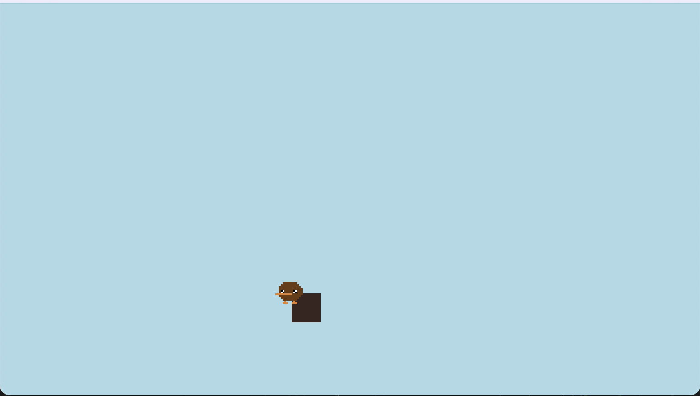

# Platformer



## Description

A basic platformer template made in Turbo!

## Getting Started

From the project dir, run the following command:

```sh
turbo run -w .
```
**Development Tips:**
- If you update sprites while your game is running, Turbo will immediately show the changes. Just be sure to restart Turbo when adding new sprites.
- Using the keyboard shortcut `cmd+r / ctrl+r` will reset your game to its initial state

## Walkthrough

### Game Configuration  

The `turbo::cfg!` macro is used to define metadata and settings for your game.

- `name, version, author`: Basic information about your game.
- `description`: A short description of your game.
- `resolution`: The resolution of the game window.

```rs
turbo::cfg! {r#"
    name = "Platformer"
    version = "1.0.0"
    author = "Turbo"
    description = "A turbo platformer template"
    [settings]
    resolution = [384, 216]
"#} 
```

### Step One: Render the tiles and player

We're going to use these sprites for the player:

IDLE:


WALKING:


TILE:


To start, we're going to render our player and tiles on screen. We can make a custom struct and impl for each. A struct holds data related to a specific object type, and an impl holds functions. 

```rs
#[derive(BorshDeserialize, BorshSerialize, Debug, Clone, PartialEq)]
struct Player {
    x: f32,
    y: f32,
    speed_x: f32,
    speed_y: f32,
    max_gravity: f32,
    is_falling: bool,
    is_facing_left: bool,
    is_landed: bool,
}

impl Player {
    fn new(x: f32, y: f32) -> Self {
        Self {
            x,
            y,
            speed_x: 0.0,
            speed_y: 0.0,
            max_gravity: 15.0,
            is_falling: false,
            is_facing_left: false,
            is_landed: false,
        }
    }

    fn draw(&self) {
            sprite!(
                "kiwi_idle",
                x = self.x as i32,
                y = self.y as i32,
                flip_x = self.is_facing_left,
                fps = fps::FAST
            );
        }
    }

#[derive(BorshSerialize, BorshDeserialize, PartialEq, Debug, Clone)]
struct Tile {
    grid_x: usize,
    grid_y: usize,
}

impl Tile {
    fn new(grid_x: usize, grid_y: usize,) -> Self {
        Self {
            grid_x,
            grid_y,
        }
    }

    fn draw(&self) {
        let x = self.grid_x as i32 * TILE_SIZE;
        let y = self.grid_y as i32 * TILE_SIZE;

        sprite!("tile", x = x, y = y);
    }

}
```
Now we need to add the player and tiles to our game state in our turbo:init section. We've also defined a const value for TILE_SIZE, which tells the game that our tiles are 16 pixels wide.

```rs
const TILE_SIZE: i32 = 16;

turbo::init! {
    struct GameState {
        player: Player,
        tiles: Vec<Tile>,
    } = {
        let mut tiles = Vec::new();
        tiles.push(Tile::new(10,10));
        GameState {
            player: Player::new(150., 150.),
            tiles,
        }
    }
}
```

Lastly, we want to call the draw functions for player and tiles inside the turbo:go! loop. Here is how we do that:

```rs
turbo::go! ({
    let mut state = GameState::load();
    clear(0xadd8e6ff);
    for t in &mut state.tiles{
        t.draw();
    }
    state.player.draw();
    state.save();
});
```

### Game Loop

The game loop is the core of your game, handling user input, updating the game state, and rendering. A typical Turbo game loop follows the following pattern:

```rs
turbo::go! {
    // Load the current frame's game state
    let mut state = GameState::load();

    // Update the game state and draw graphics
    // ...

    // Save the game state for the next frame
    state.save();
}
```

In this walkthrough, we will cover:

- Cat movement
- Pancake generation, movement, and collision
- Drawing various game elements

#### Cat movement

The following code handles the left and right movements of the cat via player 1's gamepad:

```rs
if gamepad(0).left.pressed() {
    state.cat_x -= 2.;
}
if gamepad(0).right.pressed() {
    state.cat_x += 2.;
}
```

#### Pancake Generation

There is a 1/64th chance of generating a new pancake each frame. The `x`, `vel`, and `radius` of the pancakes are also randomized:

```rs
if rand() % 64 == 0 {
    // Create a new pancake with random attributes
    let pancake = Pancake {
        x: (rand() % 256) as f32,
        y: 0.0,
        vel: (rand() % 3 + 1) as f32,
        radius: (rand() % 10 + 5) as f32,
    };
    state.pancakes.push(pancake);
}
```

#### Pancake Movement and Collision

Updating pancake positions and checking for collisions with the cat:

```rs
let cat_center = (state.cat_x + state.cat_r, state.cat_y + state.cat_r);
state.pancakes.retain_mut(|pancake| {
    pancake.y += pancake.vel;

    // Check for collision with the cat
    let pancake_center = (pancake.x + pancake.radius, pancake.y + pancake.radius);

    // Calculate the distance between the cat and the pancake
    let dx = cat_center.0 - pancake_center.0;
    let dy = cat_center.1 - pancake_center.1;

    let distance = (dx * dx + dy * dy).sqrt();
    let radii_sum = state.cat_r + pancake.radius;
    let radii_diff = (state.cat_r - pancake.radius).abs();

    if radii_diff <= distance && distance <= radii_sum {
        // Cat caught the pancake
        state.score += 1;
        state.last_munch_at = state.frame;
        false // Remove the pancake from the game
    } else if pancake.y < 144. + (pancake.radius * 2.) {
        true // Keep the pancake in the game if it's within the screen
    } else {
        false // Remove the pancake if it's off-screen
    }
});
```

#### Drawing the Background

Draw a tiled background of moving sprites:

```rs
clear(0x00ffffff);
// Draw a tiled background of moving sprites
let frame = (state.frame as i32) / 2;
for col in 0..9 {
    for row in 0..6 {
        let x = col * 32;
        let y = row * 32;
        let x = ((x + frame) % (272 + 16)) - 32;
        let y = ((y + frame) % (144 + 16)) - 24;
        sprite!("heart", x = x, y = y);
    }
}
state.frame += 1;
```

#### Drawing Speech Bubbles

Draw a speech bubble when the cat eats a pancake:

```rs
if state.frame >= 64 && state.frame.saturating_sub(state.last_munch_at) <= 60 {
    rect!(w = 30, h = 10, x = state.cat_x as i32 + 32, y = state.cat_y as i32);
    circ!(d = 10, x = state.cat_x as i32 + 28, y = state.cat_y as i32);
    rect!(w = 10, h = 5, x = state.cat_x as i32 + 28, y = state.cat_y as i32 + 5);
    circ!(d = 10, x = state.cat_x as i32 + 56, y = state.cat_y as i32);
    text!("MUNCH!", x = state.cat_x as i32 + 33, y = state.cat_y as i32 + 3, font = Font::S, color = 0x000000ff);
}
```

#### Drawing the Cat

Here's how to draw the cat. Since its sprite is a horizontal strip, it is automatically animated:

```rs
sprite!("munch_cat", x = (state.cat_x - state.cat_r) as i32, y = (state.cat_y - 4.) as i32, fps = fps::FAST);
```

#### Drawing the Pancakes

Draw the falling pancakes

```rs
for pancake in &state.pancakes {
    circ!(x = pancake.x as i32, y = pancake.y as i32 + 1, d = (pancake.radius + 2.) as u32, color = 0x000000aa); // Render the pancakes
    circ!(x = pancake.x as i32, y = pancake.y as i32, d = (pancake.radius + 1.) as u32, color = 0xf4d29cff); // Render the pancakes
    circ!(x = pancake.x as i32, y = pancake.y as i32, d = pancake.radius as u32, color = 0xdba463ff); // Render the pancakes
}
```

#### Drawing the Score

Draw the score (aka number of pancakes eaten):

```rs
text!(&format!("Score: {}", state.score), x = 10, y = 10, font = Font::L, color = 0xffffffff); // Render the score
```
