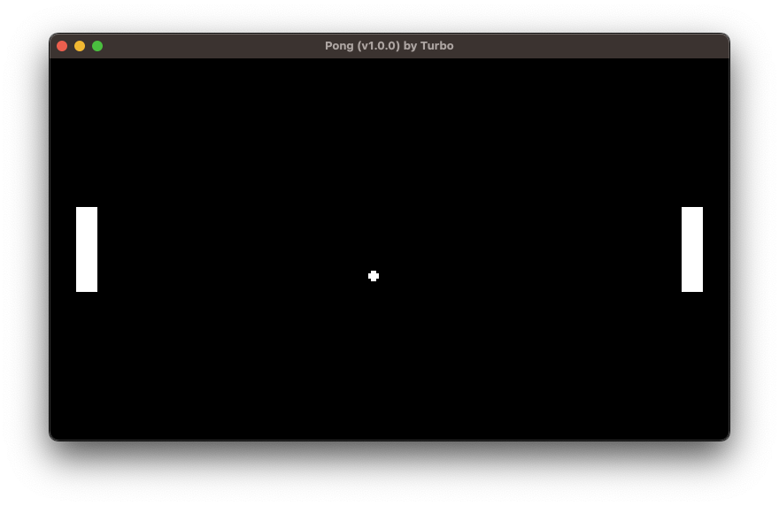

# PONG

change directory into pong

The game configuration is where you define metadata and settings for your game.
```rust
// Define the game configuration using the turbo::cfg! macro
turbo::cfg! {r#"
    name = "Pong"
    version = "1.0.0"
    author = "Turbo"
    description = "A simple Pong game"
    [settings]
    resolution = [256, 144]
"#}

```
- `name, version, author`: Basic information about your game.
- `description`: A short description of your game.
- `resolution`: The resolution of the game window.

#### Game State Initialization

Game State Initialization
```rust
// Define the game state initialization using the turbo::init! macro
turbo::init! {
    struct GameState {
        paddle1: struct Paddle {
            x: f32,
            y: f32,
            height: f32,
        },
        paddle2: Paddle,
        ball: struct Ball {
            x: f32,
            y: f32,
            velocity_x: f32,
            velocity_y: f32,
            radius: f32,
        },
    } = {
        let res = resolution();
        let w = res[0] as f32;
        let h = res[1] as f32;
        let paddle_height = 32.0;
        let paddle_width = 8.0;
        let ball_radius = 4.0;
        Self {
            paddle1: Paddle { x: 10.0, y: h / 2.0 - paddle_height / 2.0, height: paddle_height },
            paddle2: Paddle { x: w - paddle_width - 10.0, y: h / 2.0 - paddle_height / 2.0, height: paddle_height },
            ball: Ball { x: w / 2.0, y: h / 2.0, velocity_x: 2.0, velocity_y: 2.0, radius: ball_radius },
        }
    }
}
```
- This section defines the initial state of the game, including paddle and ball attributes.
- Initial positions, dimensions, and velocities of paddles and the ball are set up.

#### Game Loop

The game loop is the core of your game, handling user input, updating the game state, and rendering.
```rust
// Implement the game loop using the turbo::go! macro
turbo::go! {
    let mut state = GameState::load();

    let paddle_speed = 4.0;

    let res = resolution();
    let screen_w = res[0] as f32;
    let screen_h = res[1] as f32;

    let gp1 = gamepad(0);
    let gp2 = gamepad(1);

    // Move paddle 1
    if gp1.up.pressed() && state.paddle1.y > 0.0 {
        state.paddle1.y -= paddle_speed;
    }
    if gp1.down.pressed() && state.paddle1.y + state.paddle1.height < screen_h {
        state.paddle1.y += paddle_speed;
    }

    // Move paddle 2
    if gp2.up.pressed() && state.paddle2.y > 0.0 {
        state.paddle2.y -= paddle_speed;
    }
    if gp2.down.pressed() && state.paddle2.y + state.paddle2.height < screen_h {
        state.paddle2.y += paddle_speed;
    }

    // Update ball position
    state.ball.x += state.ball.velocity_x;
    state.ball.y += state.ball.velocity_y;

    // Ball collisions with paddles
    if (state.ball.x - state.ball.radius < state.paddle1.x + 8.0 &&
        state.ball.y > state.paddle1.y &&
        state.ball.y < state.paddle1.y + state.paddle1.height) ||
       (state.ball.x + state.ball.radius > state.paddle2.x &&
        state.ball.y > state.paddle2.y &&
        state.ball.y < state.paddle2.y + state.paddle2.height) {
        state.ball.velocity_x = -state.ball.velocity_x;
    }

    // Ball collisions with top and bottom
    if state.ball.y - state.ball.radius < 0.0 || state.ball.y + state.ball.radius > screen_h {
        state.ball.velocity_y = -state.ball.velocity_y;
    }

    // Ball out of bounds (scoring)
    if state.ball.x < 0.0 || state.ball.x > screen_w as f32 {
        // Reset ball position
        state.ball.x = screen_w as f32 / 2.0;
        state.ball.y = screen_h / 2.0;
    }

    // Draw paddles and ball
    rect!(
        x = state.paddle1.x as i32,
        y = state.paddle1.y as i32,
        w = 8,
        h = state.paddle1.height as u32,
        color = 0xffffffff
    );
    rect!(
        x = state.paddle2.x as i32,
        y = state.paddle2.y as i32,
        w = 8,
        h = state.paddle2.height as u32,
        color = 0xffffffff
    );
    circ!(
        x = state.ball.x as i32,
        y = state.ball.y as i32,
        d = state.ball.radius as u32,
        color = 0xffffffff
    );

    // Save game state for the next frame
    state.save();
}
```

- `GameState::load()` loads the current game state.
- User input is handled to move paddles.
- Ball position is updated, and collisions are checked.
- Paddles and the ball are drawn on the screen.
- The game state is saved for the next frame.

#### Result
 After running `turbo-cli run -w .`



