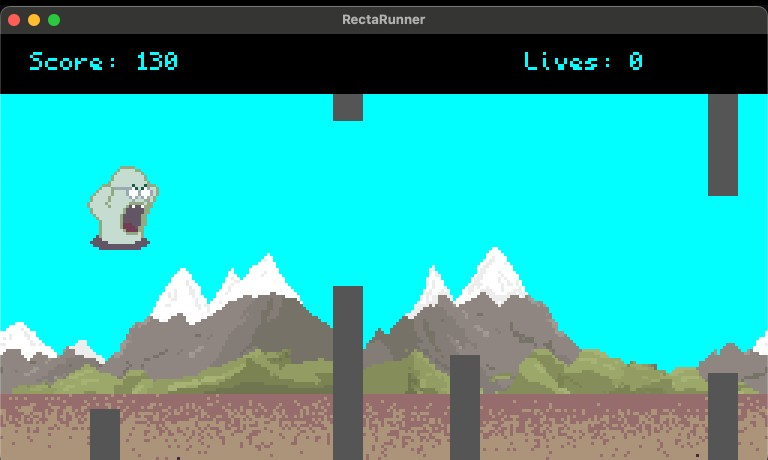

# Rectrunner



## Description

"RectaRunner" is a fast-paced, endless runner where the player navigates a rect infected world, avoiding obstacles and collecting coins that act as lives.

## Getting Started

To run this game, clone the repository and navigate to the project directory.

Run the following command:

```sh
turbo-cli run -w .
```

The screen starts blank. Use `spacebar` or touch anywhere on mobile to reset the game.
