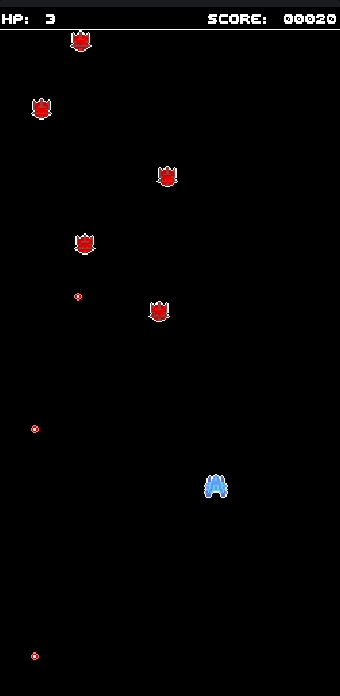

# Space Shooter



## Description

Navigate a spaceship through the depths of space, battling enemies and bosses while dodging and shooting projectiles. Collect power-ups to enhance your ship's abilities and complete quests for rewards. The longer you survive and the more enemies you defeat, the higher your score.

## Getting Started

From the project directory, run the following command:

```sh
turbo-cli run -w .
```

## Walkthrough

### Game State

Think of `GameState` as the command center of our game. It's got all the info we need:

-   `tick`: This is our game clock. It ticks forward, driving the game's events and timing.
-   `score`: Your bragging rights! The higher this number, the better you're doing.
-   `player`: Here's you! This struct has all the details about your spaceship, like health, position, and firepower.
-   `boss`: When it's time for a big challenge, the boss comes into play. This struct holds all the scary details about them.
-   `projectiles`: These are all the bullets and beams flying around. The struct keeps track of their positions and who shot them.
-   `enemies`: These guys are out to get you. The struct tracks all the enemy ships you're up against.
-   `powerups`: Everyone loves a good power-up! This struct keeps tabs on all the goodies you can pick up to boost your ship.

```rs
turbo::init! {
    struct GameState {
        tick: u32,
        notification_timer: u32,
        hit_timer: u32,

        // Game elements
        score: u32,
        tutorial_active: bool,
        help_messages: Vec<String>,
        current_quest: Option<Quest>,
        notifications: Vec<String>,
        unlockables: Unlockables,

        // Entities
        player: Player,
        boss: Option<Boss>,
        projectiles: Vec<Projectile>,
        enemies: Vec<Enemy>,
        powerups: Vec<Powerup>,
    } = {
        Self::new()
    }
}
```

### Player

The `Player` struct is all about you and your ship. It's got:

-   `x, y`: Your position in the vastness of space.
-   `health`: Keep this above zero, or it's game over!
-   `speed`: How fast you can zip around.
-   `projectile_type`: The kind of firepower you're packing.
-   And a bunch of other cool stats about your ship.

### Enemy

Enemies make the game fun and challenging. Each `Enemy` struct holds:

-   `x, y`: Where they are in the game world.
-   `health`: How much damage they can take before going kaboom.
-   `strategy`: Every enemy is unique; this tells them how to behave.

### Powerup

Powerups are like little gifts in the game. The `Powerup` struct includes:

-   `x, y`: Where to find them.
-   `effect`: What cool boost they'll give you.

### Projectile

Last but not least, `Projectile` is all about the ammo flying around. It tracks:

-   `x, y`: The projectile's location.
-   `damage`: How much punch it packs.
-   `owner`: Who shot it? You or the bad guys?

### Game Loop

The game loop is the core of your game, handling user input, updating the game state, and rendering. A typical Turbo game loop follows the following pattern:

```rs
turbo::go! {
    // Load the current frame's game state
    let mut state = GameState::load();

    // Update the game state and draw graphics
    // ...

    // Save the game state for the next frame
    state.save();
}
```

In this walkthrough, we will cover:

- Player Movement and Shooting
- Enemy Spawning and Behavior
- Power-Up Mechanics
- Collision Detection
- Rendering Game Elements

#### Player Movement and Shooting

The player's movement and shooting are essential for navigating and engaging in combat:

```rs
// Player movement handling
if gamepad(0).up.pressed() {
    state.player.y = (state.player.y - state.player.speed).max(0.0); // Move up
}
if gamepad(0).down.pressed() {
    state.player.y = (state.player.y + state.player.speed).min((screen_h - state.player.height) as f32); // Move down
}
if gamepad(0).left.pressed() {
    state.player.x = (state.player.x - state.player.speed).max(0.0); // Move left
}
if gamepad(0).right.pressed() {
    state.player.x = (state.player.x + state.player.speed).min((screen_w - state.player.width) as f32); // Move right
}

// Shooting projectiles
if gamepad(0).start.just_pressed() || gamepad(0).a.just_pressed() {
    state.projectiles.push(Projectile {
        x: state.player.x + ((state.player.width / 2) as f32) - 2.0,
        y: state.player.y,
        width: 8,
        height: 8,
        velocity: 5.0,
        angle: -90.0,
        damage: state.player.projectile_damage,
        projectile_type: state.player.projectile_type,
        projectile_owner: ProjectileOwner::Player,
        ttl: None,
    });
}
```

#### Enemy Spawning and Behavior

Enemies are spawned increasingly frequently as the game progresses:

```rs
// Start spawning enemies after intro dialog
if state.tick > (state.notifications.len() as u32 + 1) * 240 {
    // Enemy spawning logic based on time elapsed
    // ...
    if state.tick % spawn_rate == 0 && state.enemies.len() < 24 {
        state.enemies.push(match rand() % 8 {
            // Different enemy types
            0 => Enemy::tank(),
            // Other enemy types...
        });
    }
}
```

Enemy behaviors vary based on their strategy:

```rs
for enemy in &mut state.enemies {
    match enemy.strategy {
        EnemyStrategy::TargetPlayer(intensity, speed, size) => {
            // Logic for attacking with specified intensity
            enemy.y += enemy.speed;
            if rand() % (250 / intensity as u32) == 0 {
                // Calculate angle from enemy to player
                let angle = ((state.player.y - enemy.y).atan2(state.player.x - enemy.x) * 180.0) / std::f32::consts::PI;

                // Create and shoot projectiles from enemy towards the player
                state.projectiles.push(Projectile {
                    x: enemy.x + (enemy.width as f32 * 0.5) - (size as f32 * 0.5),
                    y: enemy.y + (enemy.height as f32),
                    width: size,
                    height: size,
                    velocity: speed,
                    angle: angle,
                    // damage: intensity as u32, // Damage based on attack intensity
                    damage: 1,
                    projectile_type: ProjectileType::Laser, // Assuming enemy uses Laser
                    projectile_owner: ProjectileOwner::Enemy,
                    ttl: None,
                });
            }
        },
        EnemyStrategy::ShootDown(intensity, speed, size) => {
            // Logic for attacking with specified intensity
            enemy.y += enemy.speed;
            if rand() % (250 / intensity as u32) == 0 {
                // Create and shoot projectiles from enemy towards the player
                state.projectiles.push(Projectile {
                    x: enemy.x + (enemy.width as f32 * 0.5) - (size as f32 * 0.5),
                    y: enemy.y + (enemy.height as f32),
                    width: size,
                    height: size,
                    velocity: speed,
                    angle: 90.0,
                    // damage: intensity as u32, // Damage based on attack intensity
                    damage: 1,
                    projectile_type: ProjectileType::Laser, // Assuming enemy uses Laser
                    projectile_owner: ProjectileOwner::Enemy,
                    ttl: None,
                });
            }
        },
        EnemyStrategy::MoveDown => {
            enemy.y += enemy.speed;
        },
        EnemyStrategy::RandomZigZag(angle) => {
            // Logic for dodging attacks, using angle to determine movement
            enemy.x += enemy.speed * enemy.angle.cos();
            enemy.y += enemy.speed;
            // Reverse direction when heading out of bounds
            if enemy.x < 0.0 || enemy.x > screen_w as f32 {
                enemy.angle = std::f32::consts::PI - enemy.angle;
            }
            // 5% chance to randomly change angle
            else if rand() % 20 == 0 {
                enemy.angle += std::f32::consts::PI / angle; // Change angle
            }
        },
    }
}
```

#### Power-Up Mechanics

Power-ups appear periodically and provide benefits when collected:

```rs
// Every 30s, spawn a heal at a random location
if state.tick % (60 * 30) == 0 {
    state.powerups.push(Powerup {
        // Powerup attributes
    });
}

// Spawn a heal every 10s when player's health is low
if state.tick % (60 * 10) == 0 && state.player.health == 1 {
    state.powerups.push(Powerup {
        // Powerup attributes
    });
}
```

When the player picks up a powerup, various effects are applied and they are removed from the game state:

```rs
// Handle player picking up power-ups
state.powerups.retain(|powerup| {
    if check_collision(powerup.x, powerup.y, powerup.width, powerup.height,
                    state.player.x, state.player.y, state.player.width, state.player.height) {
        match powerup.effect {
            PowerupEffect::Heal => {
                state.player.health = (state.player.health + 1).min(state.player.max_health);
                state.player.skill_points += 1;
                state.notifications.push("+1 Health".to_string());
            },
            PowerupEffect::MaxHealthUp => {
                state.player.max_health = (state.player.max_health + 1).min(10);
                state.player.health = state.player.max_health;
                state.player.skill_points += 1;
                state.notifications.push("Max Health +1".to_string());
            },
            PowerupEffect::SpeedBoost => {
                state.player.speed *= 1.1;
                state.player.skill_points += 1;
                state.notifications.push("1.1x Speed Boost".to_string());
            },
            PowerupEffect::DamageBoost(projectile_type) => {
                if state.player.projectile_type == projectile_type {
                    state.notifications.push(format!("+1 {projectile_type:?} Damage"));
                    state.player.skill_points += 1;
                    state.player.projectile_damage = (state.player.projectile_damage + 1).min(2);
                }
            }
        }
        false // Remove the power-up after it's picked up
    } else {
        true
    }
});
```

#### Collision Detection

Collision detection is crucial for interactions between the player, enemies, projectiles, and power-ups. Detection occurs in multiple spots in the game loop, but it is always based on rectangular intersection and uses the `check_collision` function:

```rs
fn check_collision(x1: f32, y1: f32, w1: u32, h1: u32, x2: f32, y2: f32, w2: u32, h2: u32) -> bool {
    let x1 = x1 as i32;
    let y1 = y1 as i32;
    let w1 = w1 as i32;
    let h1 = h1 as i32;
    let x2 = x2 as i32;
    let y2 = y2 as i32;
    let w2 = w2 as i32;
    let h2 = h2 as i32;
    x1 < x2 + w2 && x1 + w1 > x2 &&
    y1 < y2 + h2 && y1 + h1 > y2
}
```

#### Drawing the Player's Spaceship

The player's spaceship is a central visual element. It's rendered according to its current state, including position, health, and any active power-ups or effects. The spaceship's design can be detailed to make it visually appealing and distinct.

```rs
fn draw_player(player: &Player) {
    rect!(
        x = player.x as i32,
        y = player.y as i32,
        w = player.width,
        h = player.height,
        color = player.color
    );
    if let Some(accessory) = &player.accessory {
        sprite!(accessory, x = player.x as i32, y = player.y as i32);
    }
}
```

#### Drawing Enemies

Each enemy is a basic rectangle.

```rs
fn draw_enemy(enemy: &Enemy) {
    rect!(
        x = enemy.x as i32,
        y = enemy.y as i32,
        w = enemy.width,
        h = enemy.height,
        color = 0xaaaaaaff
    );
}
```

#### Drawing Projectiles

Projectiles are rendered as circles moving across the screen.

```rs
fn draw_projectile(projectile: &Projectile) {
    let color = match projectile.projectile_type {
        ProjectileType::Splatter | ProjectileType::Fragment => 0xff0000ff,
        ProjectileType::Basic | ProjectileType::Bomb | ProjectileType::Laser => 0xffff00ff,
    };
    circ!(
        x = projectile.x as i32,
        y = projectile.y as i32,
        d = projectile.width.max(projectile.height),
        color = color
    );
}
```

#### Drawing Power-Ups

Power-ups are rendered to stand out and attract the player's attention. They have a pulsing effect to signify their importance and benefits.

```rs
fn draw_powerup(powerup: &Powerup, tick: u32) {
    let n = (tick as f32 * 0.15).cos() * 3.0;
    circ!(
        x = (powerup.x - (n * 0.5)) as i32,
        y = (powerup.y - (n * 0.5)) as i32,
        d = powerup.width.max(powerup.height) + n as u32,
        color = match powerup.effect {
            PowerupEffect::Heal => 0x00ff66ff,
            PowerupEffect::MaxHealthUp => 0x00ffffff,
            PowerupEffect::DamageBoost(_) => 0xff0066ff,
            PowerupEffect::SpeedBoost => 0x6600ffff,
        }
    );
}
```

#### Drawing UI Elements

UI elements like the score, health bar, and any active notifications or messages are rendered in a way that's clear and unobtrusive to the gameplay. The design of these elements is often sleek and futuristic, aligning with the space theme.

```rs
fn draw_hud(state: &GameState, screen_w: u32) {
    // Drawing the HUD panel
    let hud_height = 16; // Height of the HUD panel
    rect!(
        x = 0,
        y = 0,
        w = screen_w,
        h = hud_height,
        color = 0x000000ff
    ); // Black background for the HUD

    // Drawing borders for the HUD section
    rect!(
        x = 0,
        y = hud_height as i32,
        w = screen_w,
        h = 1,
        // border = 1,
        color = 0xffffffff
    ); // White border

    // Displaying game information on the HUD
    let hud_padding = 4; // Padding inside the HUD
    let text_color = 0xffffffff; // White text color

    // Display Score
    let score_text = format!("LVL: 1");
    text!(
        &score_text,
        x = hud_padding,
        y = hud_padding,
        font = Font::L,
        color = text_color
    );

    // Display Health
    let health_text = format!("HP: {}", state.player.health);
    let health_text_x = (screen_w as i32 / 2) - ((health_text.chars().count() as i32 * 8) / 2);
    text!(
        &health_text,
        x = health_text_x,
        y = hud_padding,
        font = Font::L,
        color = text_color
    );

    // Display Skill Points
    let skill_points_text = format!("XP: {:0>5}", state.player.skill_points);
    let skill_points_text_x =
        screen_w as i32 - (skill_points_text.chars().count() as i32 * 8) - hud_padding;
    text!(
        &skill_points_text,
        x = skill_points_text_x,
        y = hud_padding,
        font = Font::L,
        color = text_color
    );
}
```

#### Camera Shake

To add impact, when the player is hit, we adjust the camera's x and y position randomly by 3px until the hit timer expires.

```rs
if state.hit_timer > 0 {
    set_camera(rand() as i32 % 3, rand() as i32 % 3);
} else {
    set_camera(0, 0);
}
```

#### Game Over Screen

When the game ends, a distinct "Game Over" screen is displayed. This screen often includes the final score and might offer options like restarting the game or returning to the main menu.

```rs
fn draw_game_over(state: &GameState, screen_w: u32, screen_h: u32) {
    text!(
        "GAME OVER",
        x = (screen_w as i32 / 2) - 32,
        y = (screen_h as i32 / 2) - 4,
        font = Font::L
    );
    if state.tick / 4 % 8 < 4 {
        text!(
            "PRESS START",
            x = (screen_w as i32 / 2) - 24,
            y = (screen_h as i32 / 2) - 4 + 16,
            font = Font::M
        );
    }
}
```

Wrapping Up
-----------

So there you have it! A quick tour of the main structs that make our Space Shooter game tick. Each piece plays a vital role in creating an exciting and dynamic experience. Now, let's jump in and have some fun! 🚀🌌👾